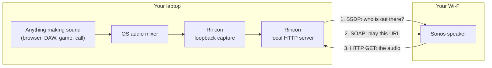
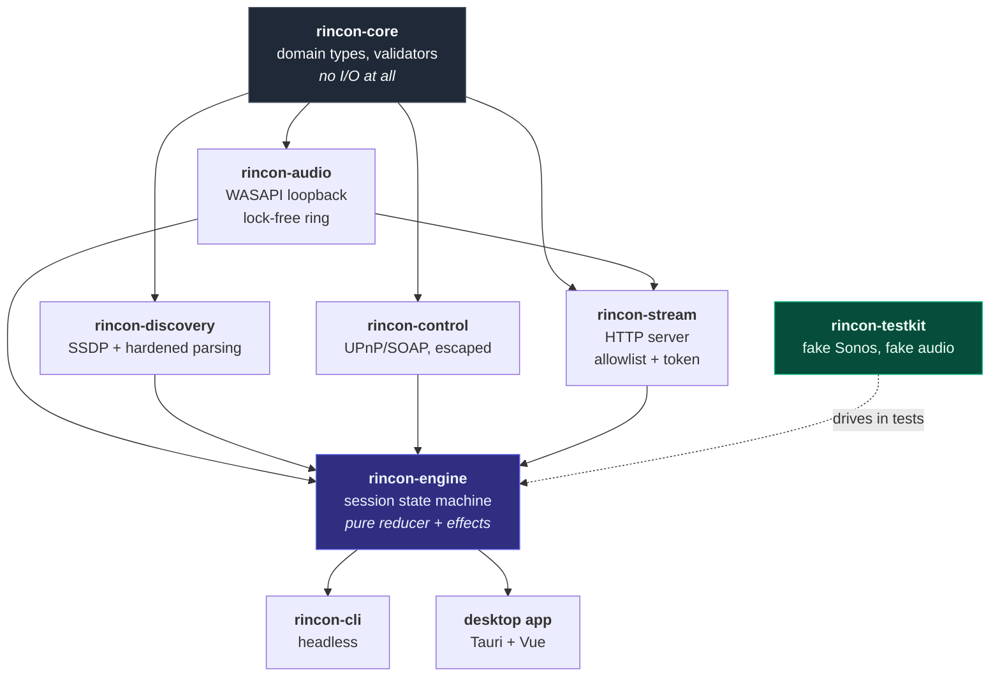
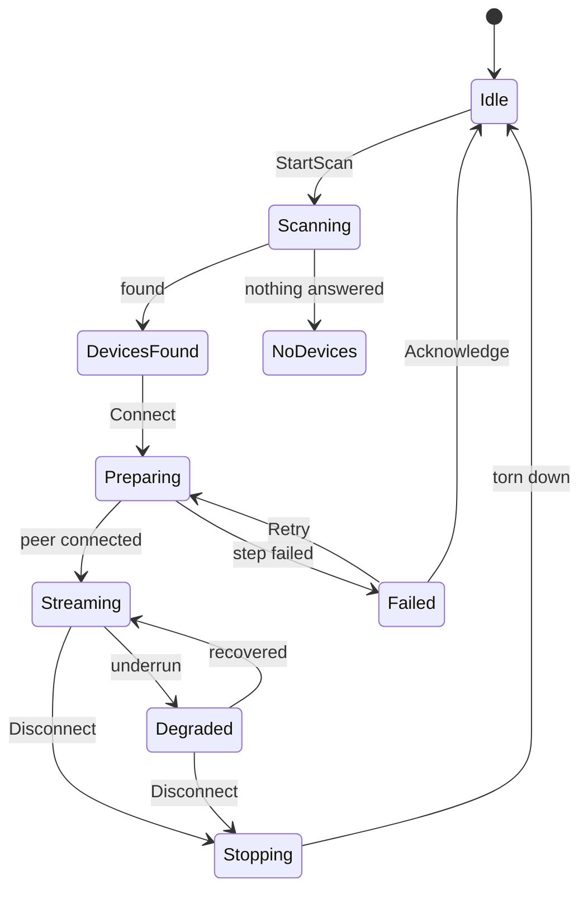
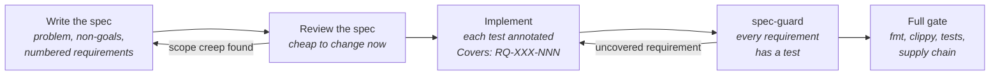

<div align="center">

# Rincon

**Play your laptop's audio on a Sonos speaker. No cable, no cloud, no account.**

[](https://github.com/EmmiSiu/rincon/actions/workflows/ci.yml)
[](https://github.com/EmmiSiu/rincon/actions/workflows/security.yml)
[](LICENSE)
[](rust-toolchain.toml)
[](specs/README.md)

</div>

---

## The problem

Your Sonos will happily play Spotify. It will not play **the thing your laptop is playing right
now** — a browser tab, a local video, a DAW, a call, a game. There is no "play my computer"
button, and on Windows there is no supported path to one at all.

Rincon adds it. It captures the system audio mix, serves it on your LAN as an ordinary HTTP
stream, and tells the speaker to fetch it. Nothing leaves the network. There is no account, no
telemetry, and no update ping.



## Honest limitation, up front

**Sonos players hold a 1–2 second jitter buffer in firmware.** Nothing on our side can remove
it; the stream is delayed by however long the speaker decides to buffer.

| Use case | Verdict |
| -------- | ------- |
| Music, podcasts, radio, anything you only listen to | Perfect |
| Video where you also watch the screen | Noticeable lip-sync offset |
| Games, calls, live monitoring | Not usable |

Rincon's interface says this while you are connected, rather than letting you find out with a
film. Full measurements and the reasoning are in [`docs/latency.md`](docs/latency.md).

## Status

| Platform | Capture backend | State |
| -------- | --------------- | ----- |
| **Windows 10/11 x64** | WASAPI loopback | in progress |
| **LG webOS** (developer mode) | TV audio tap | planned |
| **macOS 13+** | Core Audio process tap | planned |

Every platform difference lives behind one trait in `rincon-audio`. Discovery, control,
streaming, and orchestration compile and pass their tests on Windows, Linux, and macOS today,
so the later platforms are ports rather than rewrites.

---

## Architecture

Seven crates, each with one job and its own spec. Arrows are dependencies.



### A session, end to end

```mermaid
sequenceDiagram
    autonumber
    participant U as You
    participant E as rincon-engine
    participant D as rincon-discovery
    participant A as rincon-audio
    participant S as rincon-stream
    participant C as rincon-control
    participant K as Sonos

    U->>E: Scan
    E->>D: M-SEARCH on every interface
    D->>K: SSDP probe
    K-->>D: LOCATION + UDN
    D->>K: GET device description
    Note over D: validate, cap, parse without DTD
    D-->>E: [Kitchen, Living Room]
    U->>E: Connect to Kitchen
    E->>C: which speaker coordinates Kitchen?
    C-->>E: Kitchen (standalone)
    E->>A: start loopback capture
    A-->>E: 48 kHz / 2ch, ring ready
    E->>S: bind on the interface that reached Kitchen
    S-->>E: http://192.168.1.20:41234/s/&lt;token&gt;/stream.wav
    E->>C: SetAVTransportURI + Play
    C->>K: SOAP
    K->>S: GET the stream
    Note over S: allowlist ✓  token ✓  cap ✓
    S-->>K: WAV header, then PCM, forever
    Note over K: ~1–2 s firmware buffer
    K-->>U: 🔊
```

### The state machine

Orchestration is a **pure reducer**: `step(state, event) -> (state, effects)`. No I/O, no clock,
no allocation beyond the effects it returns — so every transition is unit-testable without a
socket, a speaker, or a sound card.



---

## The stack, and why

| Layer | Choice | Why this one |
| ----- | ------ | ------------ |
| Core | **Rust** (edition 2024) | A real-time audio callback cannot afford a GC pause or a data race. `Send`/`Sync` make the callback-to-async boundary a compile error instead of a crackle. |
| Capture | **cpal** → WASAPI loopback | One trait, three future backends. Loopback is a WASAPI mode; cpal exposes it without us writing COM. |
| Ring buffer | **crossbeam-queue** `ArrayQueue` | Bounded, lock-free, safe. `force_push` gives drop-oldest semantics while recycling the evicted allocation, so overrun costs zero allocations. |
| HTTP server | **axum** on **hyper** + **tokio** | One route, streaming body, graceful shutdown. Mature enough that the security surface is known. |
| Device protocol | **quick-xml** + hand-built SOAP | No UPnP framework. The envelopes are 20 lines and every interpolation is escaped by construction — a framework would hide exactly the part that matters. |
| Desktop shell | **Tauri 2** | ~10 MB installer against Electron's ~150 MB, and a WebView with a CSP we control. |
| Interface | **Vue 3** + TypeScript + Tailwind | Types generated from the Rust DTOs, so a backend change breaks the build instead of the app. |
| Errors | **thiserror** | Every failure is a variant with a user-facing sentence and a retry classification. There are no `String` errors. |
| Tests | `cargo test`, **proptest**, **wiremock**, `criterion` | Parsers get properties, protocols get golden fixtures, the network gets fakes. |

The full trade-off analysis for each is in [`docs/adr/`](docs/adr/).

---

## Quick start

### Use it

Grab the installer from [Releases](https://github.com/EmmiSiu/rincon/releases), run it, click
**Scan**, pick a room. That is the whole flow.

### Build it

```bash
git clone https://github.com/EmmiSiu/rincon
cd rincon
```

<details open>
<summary><b>Windows</b> (the target platform)</summary>

Needs the MSVC toolchain, because Tauri and WASAPI both do:

```powershell
winget install Rustlang.Rustup
winget install Microsoft.VisualStudio.2022.BuildTools --override "--quiet --wait --add Microsoft.VisualStudio.Workload.VCTools"
```

Then:

```bash
cargo run -p rincon-cli -- discover     # find speakers, no UI
cargo run -p rincon-cli -- stream       # serve system audio, print the URL
cargo test --workspace                  # the whole suite
```

> **If the build fails with "A Control Application policy blocked this file" (OS error 4551),**
> Windows Smart App Control is blocking the build scripts cargo generates. That is not a Rincon
> problem and it affects every Rust project on the machine.
> [`docs/development.md`](docs/development.md#smart-app-control) explains the three ways out.

</details>

<details>
<summary><b>Linux / macOS / WSL</b> (for working on the portable crates)</summary>

Everything except the Windows capture backend builds and tests here:

```bash
curl --proto '=https' --tlsv1.2 -sSf https://sh.rustup.rs | sh
bash scripts/verify.sh      # fmt + clippy + tests + spec-guard, exactly as CI runs them
```

</details>

### The whole quality gate, locally

```bash
just verify
```

That is the same sequence CI runs, in the same order, so a green local run means a green PR.

---

## Repository layout

```
rincon/
├── specs/                  ← read this first; the specs are the contract
│   ├── SPEC-000-product.md        scope, non-goals, quality gates
│   ├── SPEC-001-audio-capture.md  the real-time contract
│   ├── SPEC-002-stream-server.md  the security-critical one
│   ├── SPEC-003-discovery.md      the untrusted-input one
│   ├── SPEC-004-control.md        UPnP, escaping, grouping
│   ├── SPEC-005-engine.md         the state machine
│   ├── SPEC-006-ipc-ui.md         the WebView trust boundary
│   ├── SPEC-007-security.md       threat model
│   └── SPEC-008-observability.md  counters and diagnostics
├── crates/
│   ├── rincon-core/        domain types, validators, no I/O
│   ├── rincon-audio/       capture + the lock-free ring
│   ├── rincon-discovery/   SSDP + hardened parsing
│   ├── rincon-control/     UPnP/SOAP
│   ├── rincon-stream/      the HTTP server
│   ├── rincon-engine/      session orchestration
│   ├── rincon-testkit/     a fake Sonos, so CI needs no hardware
│   └── rincon-cli/         headless, and the porting target for webOS
├── apps/desktop/           Tauri 2 + Vue 3 + Tailwind
├── docs/
│   ├── architecture.md     how the pieces fit
│   ├── security.md         what we defend against, and what we do not
│   ├── latency.md          the 1–2 s buffer, measured
│   ├── testing.md          the testing strategy
│   ├── development.md      environment setup and its sharp edges
│   └── adr/                architecture decision records
├── AGENTS.md               the contract for AI contributors
└── scripts/spec-guard.mjs  the gate that keeps specs and tests in sync
```

---

## How this project is built

Rincon is **spec-first**. No production code is written before the spec that justifies it
exists and carries acceptance criteria a machine can check.



Every normative statement in a spec has an id like `RQ-STRM-004`. Every test that proves one
says so:

```rust
/// Covers: RQ-STRM-004, RQ-SEC-006
#[tokio::test]
async fn rq_strm_004_rejects_unallowlisted_peer() { /* ... */ }
```

`scripts/spec-guard.mjs` fails the build when a requirement has no test, when a test names a
requirement that no longer exists, or when a structural claim the specs make about the
repository stops being true. It is not a linter for comments; it is the reason the spec suite
stays worth reading.

This also makes the project pleasant to work on **with an AI assistant**: the specs are the
brief, the requirement ids are the acceptance criteria, and the gate is not opinion.
[`AGENTS.md`](AGENTS.md) is the contract they work under.

---

## Security

Rincon captures everything you hear and serves it from an open port on your home network. A
careless version of this program is a surveillance tool with a nice interface, so the threat
model is written down, not assumed: [`SPEC-007`](specs/SPEC-007-security.md).

The short version — four independent layers guard the stream, any one of which stops a casual
LAN attacker:

| Layer | Mechanism |
| ----- | --------- |
| **Bind scope** | A specific LAN interface. The wildcard requires a call literally named `allow_wildcard_bind()`. |
| **Peer allowlist** | Only the selected speaker's address, with IPv4-mapped IPv6 normalised so the rule cannot be bypassed *or* accidentally self-defeated. |
| **Unguessable URL** | 128 bits of OS entropy per session, compared in constant time, `404` on a miss so a prober learns nothing. |
| **No other surface** | One route. `/`, `/..`, and every traversal attempt return a bare `404`. |

Plus, across the codebase: no `unsafe` outside one test-only module ([ADR-0004](docs/adr/0004-test-only-allocation-probe.md)),
every XML parse refuses a `DOCTYPE`, every network read has a byte cap and a deadline, every
outbound address is checked against a private-address allowlist that closes the IPv4-mapped and
IPv4-compatible IPv6 bypasses, and capture cannot run without an active session.

**What we explicitly do not defend against** is written down too, including why the stream is
not encrypted — the honest answer is in [`SPEC-007 §7`](specs/SPEC-007-security.md), and it is
not "we forgot".

Found something? [`SECURITY.md`](SECURITY.md).

---

## Contributing

Read [`CONTRIBUTING.md`](CONTRIBUTING.md). In brief:

1. Specs change in their own PR, titled `spec: ...`.
2. Implementation PRs annotate their tests with the requirement ids they cover.
3. `just verify` must pass before you push. CI runs the same thing, so there are no surprises.

The bar is `clippy::pedantic` plus `clippy::nursery` with `-D warnings`, and it applies to the
tests as well as the code.

---

<details>
<summary><b>Resumen en español</b></summary>

**Rincon** conecta el audio de tu laptop a una bocina Sonos: captura la mezcla del sistema, la
sirve en tu red local como un stream HTTP y le dice a la bocina que lo reproduzca. Todo se queda
en la red local — sin cuenta, sin nube, sin telemetría.

**Limitación honesta:** las bocinas Sonos guardan un búfer de 1–2 segundos en su firmware. Es
perfecto para música y podcasts; para video se nota el desfase, y para juegos o llamadas no
sirve. La interfaz lo dice mientras estás conectado.

**Estado:** Windows primero, después LG webOS, después macOS. Todo lo específico de cada
plataforma vive detrás de un solo trait, así que los siguientes son ports, no reescrituras.

**Para compilar en Windows** necesitas Rust con MSVC y las Build Tools de Visual Studio; los
comandos están arriba en *Quick start*. Si el build falla con el error 4551, es Smart App
Control de Windows bloqueando los build scripts de cargo —
[`docs/development.md`](docs/development.md#smart-app-control) explica las tres salidas.

**Cómo está construido:** desarrollo dirigido por especificaciones. Cada requisito en `specs/`
tiene un identificador (`RQ-STRM-004`), cada prueba que lo demuestra lo declara, y
`scripts/spec-guard.mjs` rompe el build si algún requisito se queda sin prueba.

</details>

---

<div align="center">

MIT licensed. Not affiliated with, endorsed by, or sponsored by Sonos, Inc.<br/>
"Sonos" is a trademark of its owner and is used here only to describe compatibility.

</div>
