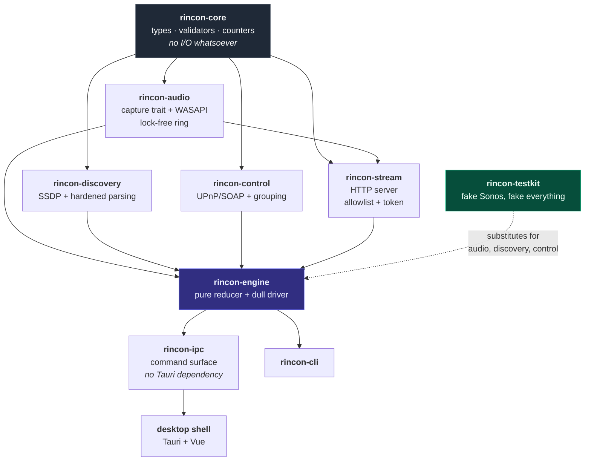
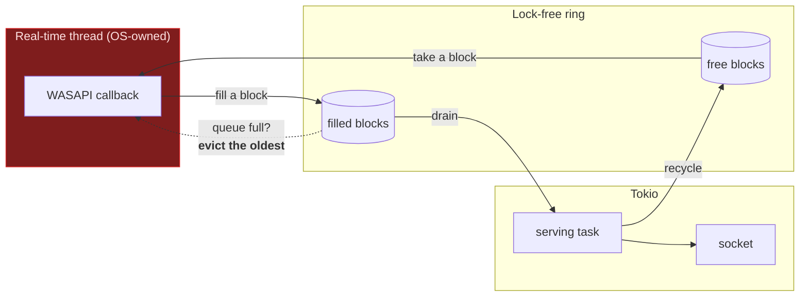
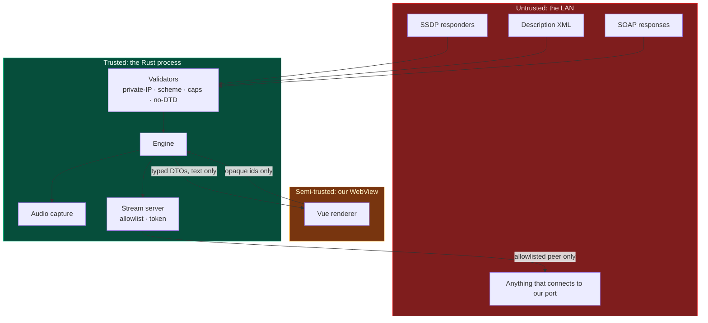

# Architecture

How the pieces fit, and why they are divided the way they are.

The [specs](../specs/README.md) say what each module must do. This says why there are these
modules and not others.

---

## The shape of the problem

Rincon does four things that fail for entirely unrelated reasons:

| Concern | Fails because | Testable without hardware? |
| ------- | ------------- | -------------------------- |
| Capturing audio | The OS, drivers, another app holding the device | No |
| Finding speakers | The network, a hostile responder, AP isolation | Yes, with a fake responder |
| Commanding speakers | Firmware quirks, grouping, XML | Yes, with a fake device |
| Serving audio | Firewalls, sockets, back-pressure | Yes, on loopback |

Three of the four are testable in CI. Only capture is not. That observation determines the
whole structure: **the untestable part is made as small as possible and put behind one trait**,
so everything else can be exercised on every pull request, on three platforms, with no speaker
in the building.

---

## Crates



### Why each boundary is where it is

**`rincon-core` performs no I/O.** It is the one crate everything else depends on, so it is the
one place a hidden network call or a blocking read would be invisible in review. Keeping it
I/O-free is also what makes the whole domain layer testable in microseconds.

**`rincon-audio` is the only crate with a `#[cfg(windows)]`.** Everything platform-specific is
behind `AudioCapture`. macOS and webOS are new modules in this crate; nothing above it changes.
That is SPEC-000 G5, made structural rather than aspirational.

**`rincon-discovery` and `rincon-control` are separate** even though both talk UPnP to the same
device on the same port. They fail differently and are attacked differently: discovery parses
unsolicited multicast from anyone, control parses responses to requests we made. Merging them
would mean one crate with two threat models.

**`rincon-stream` depends on `rincon-audio`, not the reverse.** The server pulls from a ring it
does not own. Inverting that would put HTTP concerns inside the real-time path.

**`rincon-engine` is split in two**: a pure reducer and a driver that executes effects. See
below.

**`rincon-ipc` has no Tauri dependency.** The command surface, the error shape, the device
registry, and the redaction are all tested by `cargo test --workspace` on Linux, macOS, and
Windows. The Tauri shell that wraps it is a hundred lines with no decisions in them.

**`rincon-testkit` is `publish = false`** and is the reason CI can test the engine at all.

---

## The real-time boundary

This is the one piece of genuinely hard engineering in the project.

WASAPI delivers audio on a thread the OS scheduled for real time. That callback must not
allocate, lock, or block — if it does, the user hears a click, and no amount of downstream
buffering repairs it. The consumer, meanwhile, is an async HTTP handler at the mercy of the
Tokio scheduler.



Three properties, each with a test:

1. **No allocation after start.** Blocks are pre-allocated and circulate; an evicted block goes
   straight back to the producer rather than to the free pool. Proven by a counting allocator
   asserting zero allocations across two hundred callbacks, including during overrun.
2. **Drop the oldest, not the newest.** Live audio that is 400 ms stale is worse than no audio:
   playing it would add that latency to the session permanently. Discarding it keeps the stream
   anchored to now.
3. **Every lost frame is counted and attributed.** Silent data loss is a defect. Counted loss is
   a metric the health indicator can show and a bug report can act on.

The queues are `crossbeam_queue::ArrayQueue` — bounded, lock-free, safe. This is *lock-free*,
not *wait-free*: `force_push` retries under contention. With one producer and one consumer
there is no contention to retry against, so the producer completes in a bounded number of
steps. Saying "lock-free" rather than "wait-free" is the accurate claim, and the module says so.

---

## Orchestration as a reducer

Four subsystems must be sequenced under failure, and any of them can vanish at any moment.
Written as `async` code with `if let Err` at each step, that becomes unreviewable.

So it is a pure function instead:

```rust
fn step(state: SessionState, event: Event) -> (SessionState, Vec<Effect>)
```

No I/O. No clock. No allocation beyond the effects returned. Consequences:

- Every transition the session can make is in one `match`, visible at once.
- A transition that is not written down cannot happen.
- Every failure path is unit-testable in microseconds, with no socket and no speaker.
- A late reply from a cancelled operation is inert, because the reducer has no arm for it.

The driver executes effects and feeds answers back as events. It is deliberately dull: if it
ever grows an `if` that changes the session's direction, that `if` belongs in the reducer.

---

## Trust boundaries

Every arrow crossing into the trusted region is a place something hostile gets a turn.



The WebView is *semi*-trusted rather than trusted because it renders strings that came from the
LAN. That is why commands take opaque identifiers rather than addresses: a compromised renderer
has no command that would dial an arbitrary host, because none exists.

Full analysis: [SPEC-007](../specs/SPEC-007-security.md).

---

## Where invariants live

The recurring move in this codebase is **making a bad value unrepresentable** rather than
checking for it at each call site.

| Type | Cannot be | So callers never have to |
| ---- | --------- | ------------------------ |
| `Volume` | above 100 | clamp a slider value |
| `SampleRate` | zero, or absurd | guard a division |
| `DeviceId` | empty, oversized, whitespace | sanitise a map key |
| `DeviceName` | control characters, unbounded | truncate before rendering |
| `StreamUrl` | printed or serialised with its token | remember to redact |
| `SessionToken` | compared in variable time | reach for `==` |

When you find yourself validating at a call site, ask whether the value should have been
unrepresentable instead. Usually it should.

---

## Porting

**macOS** — a new module in `rincon-audio` implementing `AudioCapture` over Core Audio. The
Tauri shell already builds; `SoapControl`, discovery, and the stream server are unchanged.

**LG webOS** — a TV runs a service binary, not a Tauri app. `rincon-cli` is that binary's
shape: it drives the same engine with no WebView. Phase 2 is a capture backend for the TV's
audio path plus a thin webOS service wrapper, and the CLI exists partly so that port is a
substitution rather than a rewrite.

Neither touches discovery, control, streaming, or orchestration. That is the whole point of the
trait boundary, and `RQ-CORE-003` — those crates build and pass tests on three platforms today —
is what keeps it true before anyone starts.
