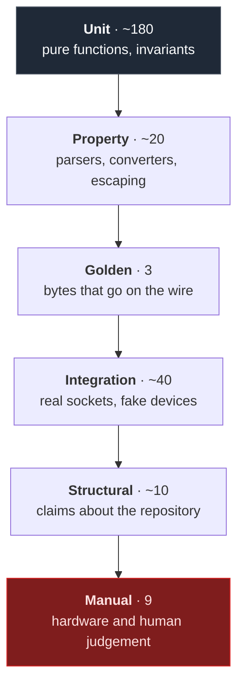

# Testing strategy

Why the tests are shaped the way they are, and what each layer is actually for.

The headline number is **274 automated checks that run on every pull request, on three
platforms, with no speaker in the building**. Getting there was a design decision, not an
accident.

---

## The constraint that shaped everything

Only one thing in Rincon genuinely needs hardware: capturing audio from a real device. Three
other subsystems — discovery, control, streaming — look like they need it and do not.

If those three had been written against real hardware, they would be tested on one developer's
laptop and nowhere else. So the architecture puts every hardware dependency behind a trait with
a fake, and the result is that the interesting failures are reachable in CI:

| Failure | Reproduced in CI by |
| ------- | ------------------- |
| A grouped speaker ignoring `Play` | `FakeControl::grouped_under` |
| A firewall eating the stream | Nobody fetching the URL, with a short timeout |
| A hostile SSDP responder | The adversarial corpus in `ssdp.rs` |
| A speaker refusing the format | `FakeControl::refusing(FormatRejected)` |
| A session leaking a port | Rebinding it after teardown |
| An allocation in the audio callback | A counting global allocator |

---

## The layers



### Unit — most of them

Pure functions and type invariants. Fast enough that the whole suite runs in seconds, which is
what makes anyone actually run it.

The rule: **assert the consequence, not the mechanism**. `RQ-STRM-004` is not satisfied by
checking for a `403` — it is satisfied by also asserting `frames_served == 0`, because the
requirement is that audio never reached the stranger.

### Property — for anything that parses or converts

Hostile input is generated better than it is imagined. Every parser has an
"arbitrary bytes never panic" property, and the interesting ones have more:

- `conversion_is_total_and_sign_preserving` — no `f32` produces a sample of the wrong sign.
  This is what "clamps, never wraps" actually means; a fixed list of values would only prove
  the cases someone thought of.
- `structure_survives_any_argument_value` — no SOAP argument, however crafted, adds or removes
  an element from the envelope. That is the real statement of "injection is impossible".
- `never_splits_a_frame` — whatever the callback and read sizes, a partial frame is never
  visible.

### Golden — for bytes on the wire

Three places where a single wrong byte produces silence with no error anywhere: the WAV header,
the SOAP envelope, the DIDL metadata. Those are compared literally against a committed fixture.

This layer has already earned its keep: the first run of `rq_strm_001` failed because the
*fixture* had the wrong RIFF chunk size. Byte-exact comparison finds arithmetic errors on
either side.

### Integration — real sockets, fake devices

`rincon-testkit::MockSonos` is an actual HTTP server that answers actual SOAP, including the
embedded sub-devices that trip up naive description parsers and the double-escaped topology
document. `rincon-stream`'s tests bind a real port on loopback and fetch from it with `reqwest`.

Nothing is stubbed at the boundary being tested. The stream server tests exercise hyper, the
control tests exercise the real HTTP client, and the engine tests run a real server with a real
audio ring.

### Structural — claims about the repository

Some requirements are not about behaviour:

- `panic = "abort"` in the release profile, so a bug cannot unwind out of an audio callback.
- `unsafe_code = "deny"` workspace-wide.
- A CSP with no `unsafe-inline` and no remote origin.
- GitHub Actions pinned by commit SHA rather than a mutable tag.
- No `v-html`, `innerHTML`, or `eval` anywhere in the interface.
- No telemetry or auto-update dependency in any manifest.

`scripts/spec-guard.mjs` and two vitest files check these. They are greps, which is usually a
smell — here it is the right tool, because the property is "this construct appears nowhere",
and only a grep can say that about code nobody has written yet.

### Manual — hardware and human judgement

Nine checks in [`manual-test-log.md`](manual-test-log.md), each with an id a requirement can
point at and a date so "we tested that" has a shelf life.

Two are about human perception rather than hardware: whether the latency note is *legible*, and
whether the window *feels* responsive during a scan. A unit test can assert the note is in the
DTO. It cannot assert somebody sees it.

---

## Traceability

Every test that proves a requirement declares it:

```rust
/// Covers: RQ-STRM-004, RQ-SEC-006
#[tokio::test]
async fn rq_strm_004_rejects_unallowlisted_peer() { /* ... */ }
```

`spec-guard` fails the build when a requirement has no test, or when a test names a requirement
that no longer exists. It also rewrites each spec's "Covered by" column from the annotations
that actually exist (`just spec-sync`), so the tables cannot quietly disagree with the code.

Current state: **103 requirements, 103 covered, 238 annotations.**

---

## Fuzzing

Four targets, one per parser that reads network bytes. They run overnight rather than on the
pull-request path, because a five-minute fuzz run finds nothing the property tests did not, and
a run long enough to find something new is longer than anyone will wait for a review.

When a target finds something, add the input to that parser's adversarial corpus **before**
fixing it, so the regression is caught by `cargo test` rather than only by the next nightly.

See [`../fuzz/README.md`](../fuzz/README.md).

---

## What is deliberately not tested

Stated so the gaps are decisions rather than oversights.

**Real Sonos firmware.** We test against a mock that behaves the way the protocol documentation
and observed traffic say a speaker behaves. A firmware that deviates will not be caught until
HW-1 in the manual log. There is no way around this without a device farm.

**Audio quality.** The tests assert that bytes arrive faithfully and that conversion is correct
at the sample level. Nobody listens. An error that survives both — a channel swap *inside* the
OS mixer, say — would pass.

**Long-running behaviour.** The suite runs in seconds. A leak that takes four hours to matter is
HW-2's job.

**Load.** One laptop, one speaker. There is no scenario with a hundred connections, so there is
no test for one.

---

## Running them

```bash
just verify          # the whole gate, in CI's order
just test            # Rust only
just test-one rincon-stream
just spec-guard      # traceability
just frontend        # typecheck, vitest, build
just fuzz parse_ssdp 300
```

On Windows, if `cargo` fails with OS error 4551, Smart App Control is blocking the build
scripts. `just verify-wsl` runs the same gate inside WSL; see
[`development.md`](development.md#smart-app-control).
