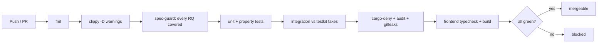

# SPEC-000 — Product definition & scope

## 1. Problem

A Sonos speaker will play from Spotify, AirPlay 2, or a line-in dongle, but it will not play
*what the laptop is currently making sound with*. Anything without a native Sonos integration —
a browser tab, a local video file, a DAW, a game, a conference call — has no path to the speaker.
The official app offers no "play my computer" mode on Windows at all.

Rincon makes the laptop's system audio output appear to a Sonos player as an ordinary network
stream, with no extra hardware, no cloud account, and no traffic leaving the LAN.

## 2. Goals

- **G1** — One-click: launch, pick a room, hear the laptop. Under 10 seconds from cold start.
- **G2** — Bit-accurate: the speaker receives exactly the samples Windows mixed. No resampling
  artefacts, no clipping, no dropouts over a multi-hour session.
- **G3** — LAN-only: zero outbound internet connections in the entire audio and control path.
- **G4** — Small: installer under 15 MB, idle RSS under 60 MB, idle CPU under 2% of one core.
- **G5** — Portable core: the Sonos protocol and streaming layers compile and pass tests on
  Windows, macOS, and Linux from day one, so webOS and macOS become ports, not rewrites.

## 3. Non-goals

- **NG1** — Lip-sync with video. Sonos players hold a 1–2 s jitter buffer in firmware. This is
  not removable from our side; see [`docs/latency.md`](../docs/latency.md). The UI must state
  this plainly rather than let users discover it.
- **NG2** — Multi-room grouping management. Rincon targets the group *coordinator* and leaves
  grouping to the Sonos app.
- **NG3** — Playing local files or acting as a music library. Sonos already does that well.
- **NG4** — Per-application capture (capturing only Chrome). Requires a different Windows API
  surface (process loopback via `ActivateAudioInterfaceAsync`). Deferred, not refused.
- **NG5** — Any telemetry, analytics, crash reporting, or update check that phones home.

## 4. Platform roadmap

| Phase | Target | Capture backend | Status |
| ----- | ------ | --------------- | ------ |
| 1 | Windows 10/11 x64 | WASAPI loopback via `cpal` | in progress |
| 2 | LG webOS (developer mode) | TV audio tap; core crates reused as an ARM service | planned |
| 3 | macOS 13+ | Core Audio process tap / ScreenCaptureKit | planned |

The `rincon-audio` crate isolates every platform difference behind one trait (`AudioCapture`).
Phases 2 and 3 add a backend module; they do not touch discovery, control, streaming, or
orchestration.

## 5. System requirements

| ID | Requirement | Verification | Covered by |
| -- | ----------- | ------------ | ---------- |
| `RQ-CORE-001` | Every network destination the app dials MUST be inside private address space (RFC1918, RFC3927, loopback, or ULA). Public addresses MUST be rejected before a socket is opened. | `unit` | `rincon_core::net::tests::rq_core_001_rejects_public_destinations` |
| `RQ-CORE-002` | The workspace MUST build with zero warnings under `clippy::pedantic` and `clippy::nursery`. | `integration` | CI job `lint` |
| `RQ-CORE-003` | `rincon-core`, `rincon-discovery`, `rincon-control`, `rincon-stream`, and `rincon-engine` MUST build and pass their tests on Windows, Linux, and macOS. | `integration` | CI job `test` matrix |
| `RQ-CORE-004` | No crate MAY contain `unsafe` code outside a module carrying a written safety rationale approved in an ADR. | `unit` | `unsafe_code = "deny"` workspace lint |
| `RQ-CORE-005` | The release profile MUST set `panic = "abort"` so a bug can never unwind out of a real-time audio callback. | `unit` | `scripts/spec-guard.mjs` manifest assertion |
| `RQ-CORE-006` | A device identifier MUST be validated on construction; an identifier that is empty or longer than 128 bytes MUST be rejected. | `unit` | `rincon_core::device::tests::rq_core_006_device_id_is_validated` |

## 6. Quality gates

A change reaches `main` only when all of these pass. There is no "warn" tier; each is a hard gate.

## 7. Success metrics

| Metric | Target | Measured by |
| ------ | ------ | ----------- |
| Cold start to audible | < 10 s | `just mvt-e2e` wall clock |
| Dropouts in a 4 h session | 0 | underrun counter in `rincon-audio` |
| Idle CPU | < 2% of one core | manual, recorded in `docs/manual-test-log.md` |
| Installer size | < 15 MB | release job artifact size assertion |
| Outbound WAN packets during a session | 0 | manual packet capture, documented |

## 8. Open questions

- [ ] Does any Sonos firmware version reject `Transfer-Encoding: chunked` for `audio/x-wav`?
      Determines whether the infinite-length header stays the default framing (SPEC-002).
- [ ] Is FLAC encoding worth its CPU budget on battery, or is L16 PCM's ~1.4 Mbps acceptable
      across all target Wi-Fi conditions?
