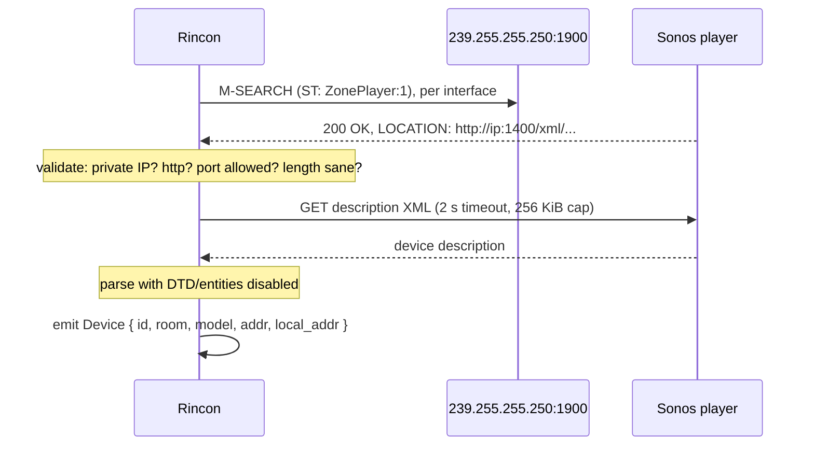

# SPEC-003 — Device discovery

## 1. Problem

The user knows their speaker as "Kitchen". The protocol knows it as an IP address that DHCP may
change at any time. Discovery bridges the two: a UDP multicast probe finds every Sonos player on
the LAN, and each one's description document supplies its room name and capabilities.

Everything discovery touches is **unauthenticated input from the network**. Any host on the LAN
can answer an SSDP probe with a crafted response. Discovery is therefore a parser hardening
problem first and a networking problem second.

## 2. Goals

- Find every reachable Sonos player in under 3 seconds on a typical home LAN.
- Work on machines with several interfaces (Wi-Fi + Ethernet + VPN + Hyper-V) by probing each.
- Report the LAN-local source address used to reach each device, so the stream server can bind
  to an interface the speaker can actually route back to.
- Never trust a byte of what comes back.

## 3. Non-goals

- mDNS / Bonjour discovery. Sonos answers SSDP reliably; a second protocol is a second attack
  surface for no gain. Manual IP entry covers the pathological network.
- Continuous background presence tracking (NOTIFY/`ssdp:alive` subscriptions) in v0.1.

## 4. Protocol

```
M-SEARCH * HTTP/1.1
HOST: 239.255.255.250:1900
MAN: "ssdp:discover"
MX: 1
ST: urn:schemas-upnp-org:device:ZonePlayer:1
```

Each responder returns a `LOCATION` header pointing at its description XML, conventionally
`http://<ip>:1400/xml/device_description.xml`. That document yields `roomName`, `modelName`,
`UDN` (`uuid:RINCON_...`), and the service control URLs.



## 5. Requirements

| ID | Requirement | Verification | Covered by |
| -- | ----------- | ------------ | ---------- |
| `RQ-DISC-001` | An SSDP response missing `LOCATION`, `ST`, or `USN` MUST be discarded without error propagation. | `unit` | `crates/rincon-discovery/src/ssdp.rs:154`<br>`crates/rincon-discovery/src/ssdp.rs:215` |
| `RQ-DISC-002` | Header parsing MUST be case-insensitive for names and MUST tolerate `\n` as well as `\r\n` line endings. | `property` | `crates/rincon-discovery/src/ssdp.rs:105`<br>`crates/rincon-discovery/src/ssdp.rs:154`<br>`crates/rincon-discovery/src/ssdp.rs:247` |
| `RQ-DISC-003` | A `LOCATION` whose host is not a private, link-local, or loopback address MUST be rejected before any request is made (SSRF guard). | `unit` | `crates/rincon-core/src/net.rs:187`<br>`crates/rincon-core/src/net.rs:298` |
| `RQ-DISC-004` | A `LOCATION` with a scheme other than `http` MUST be rejected. | `unit` | `crates/rincon-core/src/net.rs:187`<br>`crates/rincon-core/src/net.rs:308` |
| `RQ-DISC-005` | The description fetch MUST NOT follow redirects. | `integration` | `crates/rincon-discovery/src/fetch.rs:58`<br>`crates/rincon-discovery/src/fetch.rs:76`<br>`crates/rincon-discovery/src/fetch.rs:170` |
| `RQ-DISC-006` | The description response body MUST be capped at 256 KiB; a larger body MUST abort the fetch. | `integration` | `crates/rincon-discovery/src/fetch.rs:76`<br>`crates/rincon-discovery/src/fetch.rs:193`<br>`crates/rincon-testkit/src/mock_sonos.rs:366` |
| `RQ-DISC-007` | XML parsing MUST reject documents containing a DOCTYPE or entity declaration (XXE / billion-laughs guard). | `unit` | `crates/rincon-core/src/xml.rs:46`<br>`crates/rincon-core/src/xml.rs:104`<br>`crates/rincon-discovery/src/description.rs:85`<br>`crates/rincon-discovery/src/description.rs:267`<br>`crates/rincon-testkit/src/mock_sonos.rs:366` |
| `RQ-DISC-008` | Parsing MUST NOT panic on any input. Malformed input yields `Err`. | `fuzz` | `crates/rincon-discovery/src/description.rs:85`<br>`crates/rincon-discovery/src/description.rs:285`<br>`crates/rincon-discovery/src/ssdp.rs:154`<br>`crates/rincon-discovery/src/ssdp.rs:278` |
| `RQ-DISC-009` | Duplicate responses for the same UDN MUST collapse to a single `Device`. | `unit` | `crates/rincon-discovery/src/scan.rs:130`<br>`crates/rincon-discovery/src/scan.rs:373` |
| `RQ-DISC-010` | Discovery MUST probe every non-loopback IPv4 interface, and MUST record which local address reached each device. | `integration` | `crates/rincon-discovery/src/scan.rs:130` |
| `RQ-DISC-011` | Discovery MUST return within `timeout + 500 ms` even when no device answers. | `integration` | `crates/rincon-discovery/src/scan.rs:130`<br>`crates/rincon-discovery/src/scan.rs:357` |
| `RQ-DISC-012` | A room name containing XML-escaped or control characters MUST be decoded and sanitised before reaching the UI. | `property` | `crates/rincon-core/src/device.rs:102`<br>`crates/rincon-core/src/device.rs:235`<br>`crates/rincon-discovery/src/description.rs:85`<br>`crates/rincon-discovery/src/description.rs:306` |

## 6. Failure modes

| Condition | Detection | Response | User-visible result |
| --------- | --------- | -------- | ------------------- |
| No devices answer | empty result after timeout | `DiscoveryOutcome::Empty` | Empty state with "Enter IP manually" and a network-checklist link |
| Multicast blocked by the AP (client isolation) | empty result, interfaces healthy | same as above, with hint | "Your Wi-Fi may be blocking device discovery (AP isolation)." |
| Hostile responder floods answers | responses exceed cap | Stop at 64 devices, log | List truncates; no crash |
| Device answers SSDP but description fetch times out | fetch error | Device listed as `Unresolved` with its IP | Card shows the IP, marked "details unavailable" |

## 7. Performance & resource budget

| Metric | Budget | Measured by |
| ------ | ------ | ----------- |
| Full scan, typical home LAN | < 3 s | `rq_disc_011` |
| Peak memory during a scan | < 4 MiB | `benches/discovery.rs` |
| Concurrent description fetches | ≤ 8 | config constant, `rq_disc_010` |

## 8. Security considerations

Discovery is the project's primary untrusted-input boundary. Mitigations, in order of the attack
they stop:

| Attack | Mitigation | Requirement |
| ------ | ---------- | ----------- |
| SSRF to a WAN host via forged `LOCATION` | Private-address allowlist before connecting | `RQ-DISC-003` |
| SSRF via redirect to a WAN host | Redirects disabled | `RQ-DISC-005` |
| Memory exhaustion via huge description | 256 KiB body cap | `RQ-DISC-006` |
| XXE / local file disclosure | DOCTYPE and entities rejected | `RQ-DISC-007` |
| Billion laughs | Same, plus body cap | `RQ-DISC-007` |
| Parser panic → app crash (DoS) | Fuzzed parsers, no panicking paths | `RQ-DISC-008` |
| UI injection via crafted room name | Decode + sanitise; frontend never uses `v-html` | `RQ-DISC-012`, `RQ-UI-005` |
| Scheme confusion (`file://`, `gopher://`) | `http` only | `RQ-DISC-004` |

## 9. Minimum Viable Test (MVT)

```bash
just mvt-discovery
# [OK] Kitchen        Sonos One      192.168.1.45   via 192.168.1.20
# [OK] Living Room    Sonos Beam     192.168.1.51   via 192.168.1.20
```

In CI the same assertion runs against `rincon-testkit`'s `MockSonos`, which answers real SSDP on
loopback — so the path is exercised on every PR without hardware.

## 10. Open questions

- [ ] Should we also accept `ST: urn:smartspeaker-audio:service:SpeakerGroup:1` to catch newer
      models that may not advertise `ZonePlayer:1`? Needs a survey across firmware generations.
