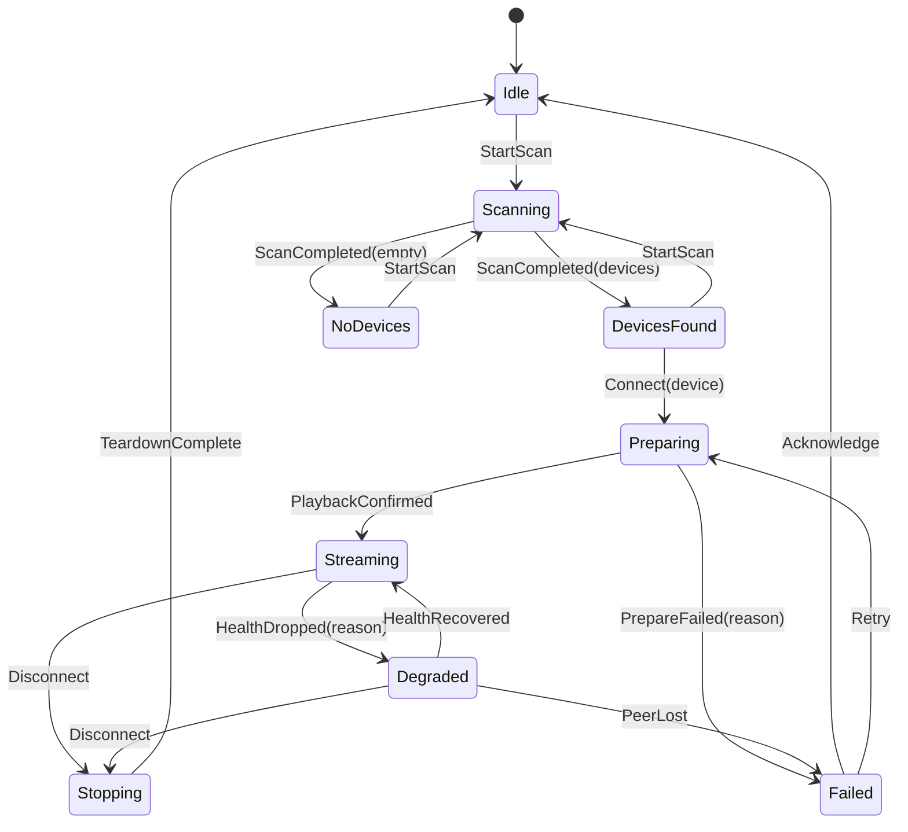
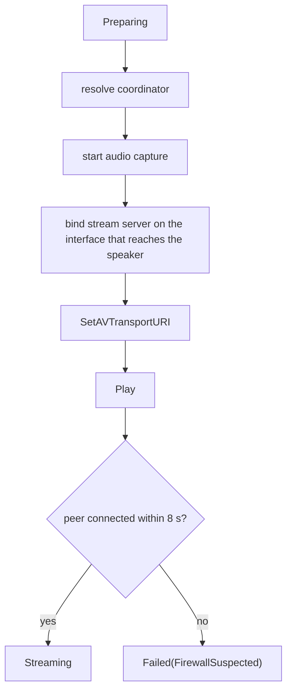

# SPEC-005 — Session orchestration

## 1. Problem

Four modules must be sequenced correctly under failure: capture must be running before the
server has anything to serve; the server must be bound before the speaker is handed a URL; the
URL must be reachable from the speaker's subnet; and any of the four can fail or vanish at any
moment. Written as ad-hoc `async` code, this becomes an unreviewable tangle of `if let Err`.

Rincon instead models the session as an **explicit state machine with a pure transition
function**. Every possible transition is enumerated in one `match`, is unit-testable without
sockets or audio hardware, and is impossible to reach by accident.

## 2. Goals

- One authoritative `SessionState` that the UI renders directly, with no derived duplicate.
- A pure reducer `fn step(state, event) -> (state, Vec<Effect>)` — deterministic, no I/O.
- Effects executed by a thin driver whose only job is calling the other crates.
- Every failure path produces a state the UI can render, never a silent hang.

## 3. Non-goals

- Multiple simultaneous sessions to different rooms. One laptop, one target, in v0.1.
- Persisting sessions across app restarts.

## 4. State machine



`Preparing` expands into an ordered effect chain; each step's failure is attributable:



## 5. Interface contract

```rust
pub enum SessionState {
    Idle,
    Scanning,
    DevicesFound { devices: Vec<Device> },
    NoDevices,
    Preparing { target: Device, step: PrepareStep },
    Streaming { target: Device, url: StreamUrl, health: Health },
    Degraded  { target: Device, reason: DegradeReason },
    Stopping  { target: Device },
    Failed    { reason: FailureReason, retryable: bool },
}

/// Pure. No I/O, no clock, no allocation beyond the returned effects.
#[must_use]
pub fn step(state: SessionState, event: Event) -> Transition;

pub struct Transition { pub state: SessionState, pub effects: Vec<Effect> }
```

## 6. Requirements

| ID | Requirement | Verification | Covered by |
| -- | ----------- | ------------ | ---------- |
| `RQ-ENG-001` | `step` MUST be pure: identical `(state, event)` inputs MUST produce identical outputs. | `property` | `rincon_engine::machine::tests::rq_eng_001_step_is_pure` |
| `RQ-ENG-002` | Every `(state, event)` pair MUST be handled; an inapplicable event MUST leave the state unchanged and emit no effects. | `property` | `rincon_engine::machine::tests::rq_eng_002_unknown_pairs_are_inert` |
| `RQ-ENG-003` | The preparation chain MUST run in the order: resolve coordinator → start capture → bind server → set URI → play. | `unit` | `rincon_engine::machine::tests::rq_eng_003_prepare_order_is_fixed` |
| `RQ-ENG-004` | The stream server MUST bind to the local address that reached the target during discovery, not to an arbitrary interface. | `unit` | `rincon_engine::machine::tests::rq_eng_004_binds_reachable_interface` |
| `RQ-ENG-005` | If the peer has not connected within 8 s of `Play`, the state MUST become `Failed(FirewallSuspected)`, which is retryable. | `unit` | `rincon_engine::machine::tests::rq_eng_005_firewall_timeout_is_classified` |
| `RQ-ENG-006` | Leaving `Streaming` or `Degraded` by any path MUST emit teardown effects for both capture and server; no effect may be skipped on the error path. | `property` | `rincon_engine::machine::tests::rq_eng_006_teardown_always_releases_resources` |
| `RQ-ENG-007` | A transient underrun MUST move the session to `Degraded`, not `Failed`, and MUST auto-recover. | `unit` | `rincon_engine::machine::tests::rq_eng_007_underrun_degrades_not_fails` |
| `RQ-ENG-008` | Reconnection MUST use exponential backoff starting at 250 ms, capped at 8 s, with at most 6 attempts. | `unit` | `rincon_engine::backoff::tests::rq_eng_008_backoff_schedule_is_bounded` |
| `RQ-ENG-009` | Every state transition MUST emit exactly one observable `StateChanged` event to subscribers. | `unit` | `rincon_engine::tests::rq_eng_009_transitions_are_observable` |
| `RQ-ENG-010` | A full connect → stream → disconnect cycle MUST leave zero live tasks, sockets, or capture streams. | `integration` | `rincon_engine::tests::rq_eng_010_cycle_leaks_nothing` |
| `RQ-ENG-011` | The driver MUST be usable with fake implementations of every trait, so the whole engine is testable without hardware. | `integration` | `rincon_engine::tests::rq_eng_011_runs_entirely_on_fakes` |

## 7. Failure taxonomy

`FailureReason` is a closed enum; each variant maps to one user-facing sentence and one
remediation affordance. This is what stops "something went wrong" ever reaching the UI.

| Variant | Cause | Retryable | Remediation offered |
| ------- | ----- | --------- | ------------------- |
| `NoCaptureDevice` | No render endpoint | yes | Open Windows sound settings |
| `CaptureBusy` | Exclusive-mode app | yes | Name the blocking app if resolvable |
| `DeviceUnreachable` | Speaker offline / IP changed | yes | Rescan |
| `RejectedByDevice { upnp_code }` | UPnP fault | depends | Explain the specific code |
| `FirewallSuspected` | Bound and playing, peer never connected | yes | Firewall rule panel (SPEC-006) |
| `NetworkIsolated` | Speaker on another subnet/VLAN | no | Explain AP isolation |
| `Internal` | Bug | no | Copy diagnostics bundle |

## 8. Performance & resource budget

| Metric | Budget | Measured by |
| ------ | ------ | ----------- |
| `step` execution | < 1 µs | `benches/machine.rs` |
| Connect → audible (excluding the speaker's own buffer) | < 1.5 s | `rq_eng_010` |
| Live tasks while `Streaming` | ≤ 4 | `rq_eng_010` |

## 9. Minimum Viable Test (MVT)

```bash
just mvt-engine         # full session against testkit fakes, no hardware
```

Passes when the engine reaches `Streaming`, serves verifiable bytes, and returns to `Idle` with
`rq_eng_010`'s leak assertions clean.

## 10. Open questions

- [ ] Should `Degraded` auto-recovery be time-based or quality-based (n consecutive clean
      seconds)? Quality-based is better but needs a metric the UI can also show.
