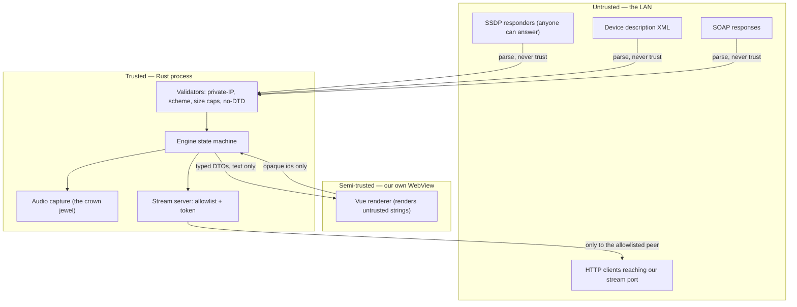

# SPEC-007 — Security & threat model

## 1. Problem

Rincon is a program that captures everything the user hears — including calls, private videos,
and anything with audio on screen — and serves it over the network from a listening socket on
their home LAN, driven by unauthenticated input from devices that anyone on that LAN can
impersonate. A careless version of this program is a surveillance tool with a nice interface.

This spec states what we defend against, what we explicitly do not, and the mechanism for each.

## 2. Assets

| Asset | Why it matters | Worst case |
| ----- | -------------- | ---------- |
| Live system audio | Contains private conversation | Silent eavesdropping by a LAN peer |
| The user's LAN topology | Device names, IPs, models | Reconnaissance for a further attack |
| Local execution context | The app runs as the user | Code execution on the laptop |

## 3. Trust boundaries

## 4. In scope

An attacker who is **already on the same LAN** and can:

- send arbitrary UDP to our SSDP socket,
- answer our M-SEARCH with a forged `LOCATION`,
- serve a hostile description or SOAP document,
- connect to our stream port and probe it,
- ARP-spoof the real speaker.

## 5. Out of scope

Stated so that the boundary is a decision, not an oversight:

- **A local attacker with code execution as the user.** They can read the audio device directly;
  Rincon is not a barrier and does not pretend to be one.
- **A malicious Sonos firmware.** If the speaker itself is hostile, the user's audio is going to
  a hostile device by definition — that is the feature.
- **Passive Wi-Fi sniffing of the stream.** See §7 for why TLS is not the answer here, and what
  the honest mitigation is.
- **Physical access to an unlocked machine.**

## 6. Requirements

| ID | Requirement | Verification | Covered by |
| -- | ----------- | ------------ | ---------- |
| `RQ-SEC-001` | No outbound connection MAY be made to a non-private IP address anywhere in the audio or control path. | `unit` | `rincon_core::net::tests::rq_sec_001_no_public_egress` |
| `RQ-SEC-002` | All XML parsing MUST reject DOCTYPE and entity declarations. | `unit` | `rincon_core::xml::tests::rq_sec_002_doctype_is_rejected_everywhere` |
| `RQ-SEC-003` | Every network read MUST have an explicit byte cap and an explicit timeout. | `unit` | `rincon_core::limits::tests::rq_sec_003_every_read_is_bounded` |
| `RQ-SEC-004` | No parser in the workspace MAY panic on adversarial input. | `fuzz` | `fuzz_targets/*`, plus `rq_disc_008` |
| `RQ-SEC-005` | Secrets (the stream token) MUST be compared in constant time and MUST NOT appear in logs. | `unit` | `rincon_stream::token::tests::rq_sec_005_token_is_redacted_in_debug` |
| `RQ-SEC-006` | The audio stream MUST be reachable only by an allowlisted peer IP. | `integration` | `rq_strm_004` |
| `RQ-SEC-007` | Capture MUST NOT run unless a session is active; stopping a session MUST stop capture. | `integration` | `rincon_engine::tests::rq_sec_007_capture_stops_with_session` |
| `RQ-SEC-008` | The app MUST NOT write captured audio to disk unless the user explicitly requests a dump. | `unit` | `rincon_audio::tests::rq_sec_008_no_implicit_disk_writes` |
| `RQ-SEC-009` | The app MUST make zero network requests at startup: no update check, no telemetry, no ping. | `integration` | `rincon_desktop::tests::rq_sec_009_startup_makes_no_requests` |
| `RQ-SEC-010` | `unsafe` MUST be denied workspace-wide; an exception requires an ADR. | `unit` | workspace lint + `scripts/spec-guard.mjs` |
| `RQ-SEC-011` | Dependencies MUST pass `cargo-deny` (licence + advisory + source) on every PR. | `integration` | CI job `supply-chain` |
| `RQ-SEC-012` | Release binaries MUST be built from a tagged commit by CI, and the workflow MUST publish provenance attestation. | `integration` | `.github/workflows/release.yml` |
| `RQ-SEC-013` | The UI MUST run under a CSP with no `unsafe-inline`, no `unsafe-eval`, and no remote origins. | `unit` | `rq_ui_004` |
| `RQ-SEC-014` | Error messages shown to the user MUST NOT leak absolute filesystem paths or internal addresses. | `unit` | `rincon_core::error::tests::rq_sec_014_errors_do_not_leak_paths` |
| `RQ-SEC-015` | GitHub Actions MUST be pinned by commit SHA, not by tag. | `unit` | `scripts/spec-guard.mjs` workflow assertion |

## 7. Rationale: why no TLS on the stream

A reasonable reviewer will ask. The answer must be written down once, properly:

Sonos players fetch stream URLs over plain HTTP and do not validate certificates in a way that
would make a self-signed certificate meaningful. Adding TLS would mean either shipping a
certificate authority into the user's trust store — a far worse security outcome than the
problem it solves — or serving a certificate nothing verifies, which provides encryption without
authentication and so stops no active attacker on the path.

The honest position is: **the stream is confidential to the extent the user's Wi-Fi is.** Rincon
therefore (a) restricts who may connect, (b) makes the URL unguessable, (c) never runs capture
without an active session, and (d) states this limitation in `SECURITY.md` rather than implying
encryption it does not provide.

If Sonos ships verifiable HTTPS stream ingestion, this decision is revisited in an ADR.

## 8. Attack / mitigation matrix

| # | Attack | Mitigation | Requirement |
| - | ------ | ---------- | ----------- |
| 1 | Forged SSDP `LOCATION` → SSRF to WAN | Private-IP allowlist pre-connect | `RQ-DISC-003` |
| 2 | Redirect chain → SSRF | Redirects disabled | `RQ-DISC-005` |
| 3 | XXE in description XML | No DOCTYPE, no entities | `RQ-SEC-002` |
| 4 | Billion laughs | No entities + 256 KiB cap | `RQ-SEC-002/003` |
| 5 | Oversized body → OOM | Byte caps on every read | `RQ-SEC-003` |
| 6 | Parser panic → crash | Fuzzing, no panicking paths | `RQ-SEC-004` |
| 7 | Rogue LAN peer pulls our audio | Peer allowlist + 128-bit token | `RQ-SEC-006`, `RQ-STRM-003` |
| 8 | Token brute force / timing oracle | Constant-time compare, 404 on miss | `RQ-STRM-005/006` |
| 9 | XSS via room name in WebView | Text-only rendering, strict CSP | `RQ-SEC-013`, `RQ-UI-011` |
| 10 | XML injection into SOAP | Escaped interpolation, property-tested | `RQ-CTL-002/003` |
| 11 | Capture running unnoticed | Capture tied to session lifetime | `RQ-SEC-007` |
| 12 | Audio silently persisted | No implicit disk writes | `RQ-SEC-008` |
| 13 | Malicious dependency | `cargo-deny`, lockfile, pinned actions | `RQ-SEC-011/015` |
| 14 | Tampered release artifact | CI-only signed builds with attestation | `RQ-SEC-012` |
| 15 | ARP-spoofed speaker | **Accepted residual risk**, documented in `SECURITY.md` | — |

## 9. Verification

| Layer | Tool | Cadence |
| ----- | ---- | ------- |
| Dependency advisories | `cargo audit`, `cargo deny` | every PR |
| Licences | `cargo deny` | every PR |
| Secret leakage | `gitleaks` | every PR |
| Static analysis | `clippy` pedantic + nursery, `-D warnings` | every PR |
| Frontend deps | `npm audit --audit-level=high` | every PR |
| Parser robustness | `cargo fuzz` | nightly |
| Threat-model drift | Review this spec | every release |

## 10. Reporting

Vulnerability reporting process and disclosure window live in
[`../SECURITY.md`](../SECURITY.md). It is referenced here so the two never diverge.
